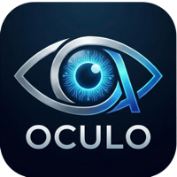

<p align="center">
  
</p>

<h1 align="center">Oculo</h1>

<p align="center">
  <strong>AI-Powered Native Browser</strong> — giving AI vision to see and interact with the web.
</p>

<p align="center">
  <a href="https://getoculo.com">Website</a> ·
  <a href="https://github.com/xidik12/oculo/releases">Download</a> ·
  <a href="#use-with-claude-code-mcp">MCP Setup</a> ·
  <a href="CONTRIBUTING.md">Contributing</a>
</p>

<p align="center">
  <a href="https://github.com/xidik12/oculo/stargazers"></a>
  <a href="https://github.com/xidik12/oculo/releases"></a>
  
  
  
  <a href="LICENSE"></a>
</p>

---

> *Latin: "to see, to give sight"* — Cursor is to VS Code what Oculo is to Chrome.

## What is Oculo?

Oculo is a desktop browser with a built-in AI assistant that can **see**, **interact with**, and **automate** web pages. It exposes browser capabilities as tools that any AI model can use — whether through the built-in chat panel or externally via Claude Code's MCP integration.

### Key Features

- **Multi-Provider AI Chat** — Claude, OpenAI, Gemini, Grok, Ollama (local), and OpenClaw
- **7 Browser Tools** — page, act, fill, read, run, devtools, media
- **Screenshot Capture** — AI takes screenshots and gets file paths back
- **Programmatic File Upload** — inject files into `<input type=file>` via CDP (no OS dialog)
- **Image Generation** — generate images via Gemini, DALL-E 3, or Stability AI
- **MCP Server** — expose browser tools to Claude Code for external automation
- **Security** — permission gate (auto/notify/confirm/blocked), credential vault (OS keychain), PII redaction
- **Modern UI** — tab groups, bookmarks, history, downloads, split view, reader mode, command palette

## Quick Start

```bash
# Clone
git clone https://github.com/xidik12/oculo.git
cd oculo

# Install
npm install

# Run
npm run dev
```

### Download

Pre-built binaries are available on the [Releases page](https://github.com/xidik12/oculo/releases):

- **macOS** — `.dmg` (Apple Silicon)
- **Windows** — `.exe` installer

Or install the MCP bridge globally:

```bash
npm install -g oculo
```

## Architecture

```
Claude Code → bin/oculo-mcp.mjs (stdio bridge) → HTTP POST :19516/mcp
→ McpServerManager (main) → IPC → Renderer → webview.executeJavaScript()
→ IPC → HTTP response → stdio bridge → Claude Code
```

### Why HTTP instead of stdio?

Electron's `<webview>` elements are only accessible from the renderer process. The main process (where stdio lives) can't directly interact with page content. So Oculo runs an HTTP MCP server that bridges the gap via IPC.

## Browser Tools

| Tool | What it does | Permission |
|------|-------------|------------|
| **page** | Describe current page (headings, forms, buttons, links) | auto |
| **act** | Click, type, navigate, scroll, screenshot, upload, download | varies |
| **fill** | Fill form fields by label matching | notify |
| **read** | Extract structured data (lists, tables, cards) | auto |
| **run** | Multi-step pipeline (batch actions) | varies |
| **devtools** | Console, inspect, evaluate, network, DOM | auto |
| **media** | Generate images/videos from text prompts | notify |

### Act Actions

`click` `doubleClick` `tripleClick` `rightClick` `clickAtPoint` `type` `focus` `clear` `selectAll` `copy` `paste` `navigate` `back` `forward` `reload` `newTab` `scroll` `scrollIntoView` `press` `hover` `select` `wait` `waitForElement` `dragAndDrop` `evaluate` `getAttribute` `upload` `login` `screenshot` `download` `listDownloads` `readFile` `clipboardImage` `switchTab` `closeTab`

## AI Providers

| Provider | Auth | Models |
|----------|------|--------|
| **Claude** | API Key or CLI Subscription | Opus, Sonnet, Haiku |
| **OpenAI** | API Key or Codex CLI | GPT-4o, GPT-4o mini, o1, o3 |
| **Gemini** | API Key | 2.0 Flash, 1.5 Pro, 1.5 Flash |
| **Grok** | API Key | Grok 2, Grok 2 Mini |
| **Ollama** | Local (no key) | Any pulled model |
| **OpenClaw** | API Key | OpenClaw models |

## Use with Claude Code (MCP)

Oculo includes an open-source MCP bridge (`bin/oculo-mcp.mjs`) that lets Claude Code in your terminal control the browser remotely. All 7 browser tools become available to Claude Code as MCP tools.

### Setup (One-Time)

**Step 1:** Make sure Oculo is installed and can run (`npm run dev` or the built app).

**Step 2:** Register the MCP server with Claude Code:

```bash
claude mcp add oculo -- node /path/to/oculo/bin/oculo-mcp.mjs
```

**Step 3:** That's it. Now when you start a Claude Code session, it will have access to Oculo's browser tools — as long as Oculo is open.

### Example Usage in Claude Code

```
You: Go to github.com and search for "electron browser"
Claude: I'll use Oculo to navigate and search.
  → act({ action: "navigate", url: "https://github.com" })
  → fill({ fields: { "Search": "electron browser" }, submit: true })
  → read({ what: "search results" })
  Found 5 results: ...
```

### MCP Bridge Source

The bridge is at [`bin/oculo-mcp.mjs`](bin/oculo-mcp.mjs). It's a simple Node.js script (~170 lines) that:
- Reads `~/.oculo-port` to find Oculo's port and auth token
- Forwards `tools/list` and `tools/call` requests over HTTP
- Returns results back to Claude Code via stdio

No API keys or accounts needed — it connects to your locally running Oculo instance.

## Media Generation

Oculo can generate images using AI providers you already have configured:

| Provider | Source | Notes |
|----------|--------|-------|
| **Gemini** | Reuses AI Provider key | Free tier available |
| **DALL-E 3** | Reuses OpenAI key | High quality |
| **Stability AI** | Separate key (Settings > Media) | Stable Diffusion 3 |

```
AI: "Generate an image of a sunset" → saves to /tmp/oculo-generated/img-xxx.png
AI: "Upload it to this post" → injects file via CDP, no dialog
```

## Security Model

### Permission Levels

- **Auto** — navigate, page, read, scroll, screenshot, hover
- **Notify** — click, type, fill, select, upload, generate
- **Confirm** — payment, delete_account, download, oauth
- **Blocked** — read_vault, export_cookies, disable_security

### Credential Vault

Passwords stored via `electron.safeStorage` → OS Keychain (macOS) / DPAPI (Windows). Never exposed through MCP or IPC.

### PII Redaction

All MCP responses pass through a redactor that strips credit cards, SSN, JWT tokens, API keys, private keys, and bearer tokens.

## Project Structure

```
src/
├── main/                  # Electron main process
│   ├── index.ts           # App entry, window, DevTools
│   ├── ipc.ts             # All IPC handlers
│   ├── menu.ts            # Native app menu
│   ├── ai/agent.ts        # Multi-provider AI controller
│   ├── engine/            # Page description, extraction, media generation
│   ├── mcp/server.ts      # HTTP MCP server
│   └── security/          # Vault, permissions, redaction, audit
├── preload/index.ts       # contextBridge API
├── renderer/
│   ├── App.tsx            # Root component + MCP tool execution
│   └── components/        # UI components
└── shared/                # Types, constants, IPC channels
```

## Scripts

```bash
npm run dev          # Development with hot reload
npm run build        # Production build
npm run typecheck    # TypeScript type checking
npm run dist:mac     # Build macOS .dmg
npm run dist:win     # Build Windows installer
npm run dist:linux   # Build Linux AppImage
npm run clean        # Remove build artifacts
```

## Tech Stack

- **Electron 34** — Chromium-based desktop app
- **TypeScript 5.7** — Strict mode
- **React 19** — Functional components + hooks
- **Tailwind CSS 3** — Utility-first styling
- **electron-vite** — Fast build tooling
- **@anthropic-ai/sdk** — Claude API
- **@modelcontextprotocol/sdk** — MCP protocol

## Contributing

See [CONTRIBUTING.md](CONTRIBUTING.md) for development setup, architecture overview, and contribution guidelines.

## License

[MIT](LICENSE)

## Author

**Salakhitdinov Khidayotullo** — [GitHub](https://github.com/xidik12)
