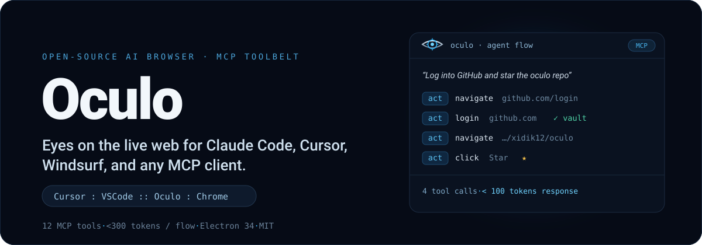
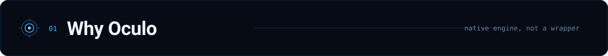
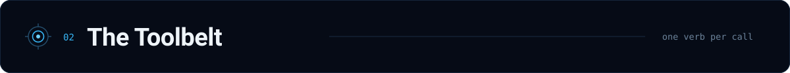
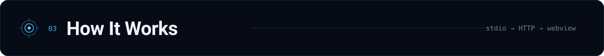
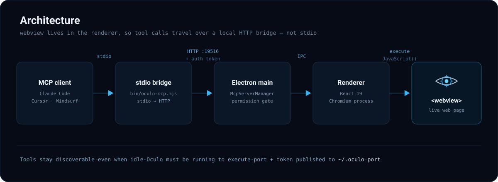
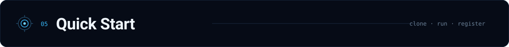
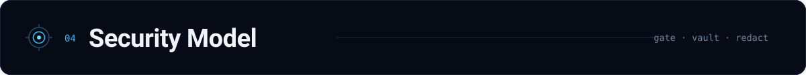

<p align="center">
  
</p>

<p align="center">
  <a href="https://github.com/xidik12/oculo/stargazers"></a>
  <a href="https://github.com/xidik12/oculo/releases"></a>
  
  
  
  
  <a href="LICENSE"></a>
</p>

<p align="center">
  <a href="https://getoculo.com">Website</a> &middot;
  <a href="https://github.com/xidik12/oculo/releases">Download</a> &middot;
  <a href="#quick-start">Quick Start</a> &middot;
  <a href="#the-toolbelt">MCP Tools</a> &middot;
  <a href="#how-it-works">Architecture</a> &middot;
  <a href="CONTRIBUTING.md">Contributing</a>
</p>

---

**Oculo** is a full-Chromium desktop browser that speaks the [Model Context Protocol](https://modelcontextprotocol.io). Point Claude Code, Cursor, Windsurf, or any MCP client at it and your agent can *see* and *drive* real web pages — read the DOM, click, fill forms, extract data, run multi-step pipelines — through 12 compact tools that answer in **under 300 tokens per flow**.

> *Cursor : VSCode :: Oculo : Chrome*

## See it in action

Your agent describes intent; Oculo resolves it into a few tiny tool calls and hands back terse, redacted results — not megabytes of screenshots.

```
You: "Log into GitHub and star the oculo repo"

Claude Code calls:
  1. act({action: "navigate", url: "https://github.com/login"})
  2. act({action: "login", site: "github.com"})         # vault lookup, password never leaves the OS keychain
  3. act({action: "navigate", url: "https://github.com/xidik12/oculo"})
  4. act({action: "click", text: "Star"})

→ 4 tool calls, <100 tokens of response
```

```
You: "Fill out the contact form on example.com"

Claude Code calls:
  1. act({action: "navigate", url: "https://example.com/contact"})
  2. page()                                               # see the form structure
  3. fill({fields: {"Name": "...", "Email": "..."}, submit: true})

→ 3 tool calls
```



Oculo runs a real Chromium engine on your machine and adds an agent-first control layer on top. That combination is the point:

| | Capability |
|---|---|
| **Native browser** | Full Chromium engine — not a wrapper, extension, or headless scraper |
| **12 MCP tools** | page, act, fill, read, run, media, shell, tabs, research, preview, translate, lens |
| **< 300 tokens / flow** | Compact text responses by default — cheaper than screenshot-based approaches |
| **Self-healing automation** | Selector caching + DOM diffing — 44%+ faster on repeated workflows |
| **Multi-provider AI** | Built-in chat with Claude, OpenAI, Gemini, Grok, OpenClaw, Ollama |
| **4-level security** | auto / notify / confirm / blocked permission gate on every action |
| **OS keychain vault** | Credentials encrypted via `electron.safeStorage` (macOS Keychain / Windows DPAPI) |
| **PII redaction** | Credit cards, SSNs, JWTs, API keys, Bearer tokens stripped from every MCP response |
| **Anti-injection** | Content boundary markers + regex-based prompt-injection detection |
| **19 stealth patches** | Navigator, WebGL, canvas, WebRTC, audio, font, battery, and screen fingerprint defenses |
| **Headless mode** | Run without a window — Docker support included |
| **Cross-platform** | macOS, Windows, Linux |
| **Python SDK** | `pip install oculo` — sync and async clients |



Each tool does one thing and returns the smallest useful answer. Token cost is the response size the agent pays for.

| Tool | What it does | Token cost |
|------|-------------|------------|
| `page` | Describe the current page — headings, forms, buttons, links. Compact, a11y (ref-tagged), and markdown modes | ~30–80 |
| `act` | Navigate, click, hover, scroll, type, press keys, login via vault, manage tabs, cookies, proxy, recording | ~1 line |
| `fill` | Fill form fields by label/placeholder matching, optional submit. Text, select, checkbox, contenteditable | ~1 line |
| `read` | Extract structured data — search results, tables, lists, articles | compact |
| `run` | Multi-step pipeline with conditionals (`page`/`act`/`fill`/`read`/`wait`/`if`). Cached for replay | header + last |
| `media` | Generate images (Nano Banana 2 / DALL·E 3) or video (Veo 3.1); image-to-image editing | file path |
| `shell` | Execute shell commands non-interactively (ls, npm, git, python, …) | stdout + stderr |
| `tabs` | List all open browser tabs with URLs and titles | compact |
| `research` | Deep web research — opens multiple tabs, reads pages, synthesizes findings | synthesized |
| `preview` | Pre-fetch a URL without navigating away from the current page | page description |
| `translate` | Translate page content or specific text to any language | translated text |
| `lens` | Visual analysis of the current page via screenshot + AI vision | description |

**Bonus:** `webmcp_list` and `webmcp_call` discover and invoke page-declared tools via the [WebMCP](https://webmcp.org) protocol.



<p align="center">
  
</p>

**Why HTTP instead of stdio?** Electron's `<webview>` is only reachable from the renderer process. The main process — where stdio lives — can't touch page content. The HTTP bridge crosses that boundary via main-to-renderer IPC.

**Port discovery.** On startup Oculo writes `port:authtoken` to `~/.oculo-port`. The `bin/oculo-mcp.mjs` bridge reads it automatically, so tool definitions stay discoverable even when the app is closed — only *execution* requires Oculo to be running.



### 1. Install

Grab the latest build from [Releases](https://github.com/xidik12/oculo/releases), or run from source:

```bash
git clone https://github.com/xidik12/oculo.git
cd oculo
npm install
npm run dev
```

### 2. Register with your MCP client

**Claude Code**

```bash
claude mcp add oculo -- node ~/oculo/bin/oculo-mcp.mjs
```

**Cursor / Windsurf** — add to your MCP config (`.cursor/mcp.json` or equivalent):

```json
{
  "mcpServers": {
    "oculo": {
      "command": "node",
      "args": ["/path/to/oculo/bin/oculo-mcp.mjs"]
    }
  }
}
```

### 3. (Optional) Headless & Docker

Run without a visible window for CI/CD, scraping, or server-side automation:

```bash
node bin/oculo-headless.mjs                          # convenience launcher
npx electron . --headless                            # or raw flags
npx electron . --headless --headless-auto-approve    # auto-approve CONFIRM actions
OCULO_HEADLESS=1 npm run dev                          # or via env var

docker compose up                                    # containerized headless (Xvfb)
```

### 4. (Optional) Python SDK

```bash
pip install oculo
```

```python
from oculo import OculoClient

client = OculoClient()                 # auto-discovers port from ~/.oculo-port
print(client.page())                   # describe the page
client.act("navigate", url="https://example.com")
client.fill({"Email": "hi@oculo.com", "Message": "Hello!"}, submit=True)
results = client.read("search results", format="json")
```

An async `AsyncOculoClient` with the same surface is also available.



Every action passes through a permission gate, and every response is redacted before it reaches the model.

### Permission levels

| Level | Actions | Behavior |
|-------|---------|----------|
| **Auto** | navigate, page, read, scroll, screenshot, back, forward, reload, hover, listTabs, switchTab, preview, translate, lens | Executes silently |
| **Notify** | click, type, fill, select, press, submit, newTab, closeTab | Executes + OS notification |
| **Confirm** | payment, delete_account, change_password, send_email, download, oauth, shell, evaluate, setProxy, startRecording | Native dialog approval required |
| **Blocked** | read_vault, export_cookies, export_tokens, disable_security | Always rejected |

### Credential vault

- Encrypted with `electron.safeStorage` → OS Keychain (macOS) / DPAPI (Windows).
- Passwords are **never** returned via IPC or MCP — only domain + username are exposed.
- `act({action: "login", site: "github.com"})` retrieves and fills credentials without the model ever seeing them.

### Redaction & anti-injection

- Every MCP response passes through a redactor that strips credit-card numbers, SSNs, JWTs, API keys, private keys, and Bearer tokens.
- Page content handed to the model is wrapped in boundary markers, and regex-based detection blocks prompt-injection attempts embedded in that content.

### Stealth (19 patches)

Navigator (webdriver, languages, plugins, mimeTypes, connection, hardwareConcurrency, deviceMemory), window (chrome API, dimensions), WebGL (vendor/renderer spoofing), canvas (per-call fingerprint randomization), WebRTC (IP-leak prevention), AudioContext, font enumeration blocking, Battery API, and screen-resolution randomization.

### Self-healing automation

After a successful `act`/`fill`, selectors are cached with stability scores — `id` and `data-testid` = 10, `aria-label` = 9, `role`+`name` = 8, `text` = 7, `css` = 5. On the next run, DOM diffing picks the strategy:

- **> 80% similarity** — replay from cache, no LLM call.
- **50–80%** — fall back to alternative selectors.
- **< 50%** — re-engage the AI for a fresh resolution.

That's where the 44%+ speed-up on repeated workflows comes from.

## Built-in AI chat

Oculo also ships a side-panel chat that talks to multiple providers directly:

| Provider | Auth | Models |
|----------|------|--------|
| **Claude** | API key or CLI subscription | Opus, Sonnet, Haiku |
| **OpenAI** | API key or Codex CLI | GPT-4o, GPT-4o mini, o1, o3 |
| **Gemini** | API key | 2.0 Flash, 1.5 Pro, 1.5 Flash |
| **Grok** | API key | Grok 2, Grok 2 Mini |
| **Ollama** | Local (no key) | Any pulled model |
| **OpenClaw** | API key | OpenClaw models |

## Building from source

```bash
npm run build          # production build
npm run dist:mac       # macOS DMG + ZIP
npm run dist:win       # Windows NSIS + portable
npm run dist:linux     # Linux AppImage + deb

npm run typecheck      # TypeScript
npm run lint           # ESLint
npm run test           # Vitest
```

**Prerequisites:** Node.js 20+, npm (not pnpm/yarn — native modules require npm), macOS / Windows / Linux.

<details>
<summary><strong>Project structure</strong></summary>

```
src/
  main/                    Electron main process
    ai/agent.ts            Multi-provider AI controller
    captcha/               CAPTCHA detection + solvers
    data/                  Bookmarks, downloads, history, session recording
    engine/                Page describer, extractor, form-detector, pipeline, resolver,
                           selector-cache, dom-differ, tab-manager
    mcp/server.ts          HTTP MCP server (ports 19516–19520, auth token)
    mcp/tools/             act, fill, page, read, run tool handlers
    network/proxy.ts       HTTP/SOCKS proxy manager
    security/              Vault, permissions, redactor, audit, anti-injection
  preload/index.ts         contextBridge API
  renderer/
    App.tsx                Root browser UI component
    components/            TabBar, AddressBar, ChatPanel, WebViewContainer,
                           bookmarks, downloads, find, history, layout, common
  shared/                  Types, constants, IPC channels, AI provider definitions
bin/
  oculo-mcp.mjs            stdio-to-HTTP MCP bridge (for Claude Code / Cursor)
  oculo-headless.mjs       Headless mode launcher
sdk/python/                Python SDK (pip install oculo)
Dockerfile                 Container deployment
docker-compose.yml         Docker Compose for headless mode
```

</details>

## Contributing

See [CONTRIBUTING.md](CONTRIBUTING.md) for development setup, architecture details, and how to add a new MCP tool.

## Donate

If Oculo saves you time, you can support development — **BTC:** `12yRGpUfFznzZoz4yVfZKRxLSkAwbanw2B`

## License

[MIT](LICENSE) © 2026 Salakhitdinov Khidayotullo

---

<p align="center">
  Built by <a href="https://github.com/xidik12">Salakhitdinov Khidayotullo</a> &middot; <a href="https://getoculo.com">getoculo.com</a>
</p>
